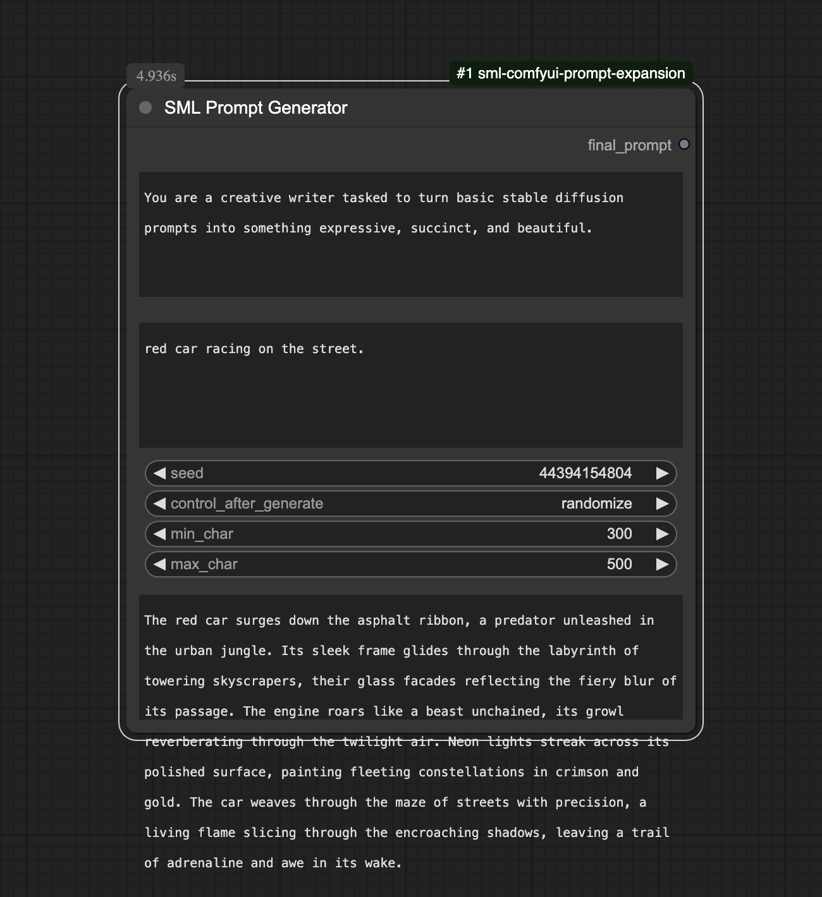

# sml-comfyui-prompt-expansion

Stable Diffusion Prompt Expansion using Deepseek API

- Create API key at https://platform.deepseek.com
- Copy `config.ini.example` to `config.ini` and put the replicate key there. 

## Installation

Navigate to where you have installed ComfyUI. For example:

```shell
cd ~/dev/ComfyUI/
```

Go to the custom nodes folder:

```shell
cd custom_nodes
```

Clone this repo

```shell
git clone https://github.com/smlbiobot/sml-comfyui-prompt-expansion
```

Go inside the repo folder

```shell
cd sml-comfyui-prompt-expansion
```

Install the requirements

```shell
pip install -r requirements.txt
```

Copy the example config `config.ini.example` to `config.ini`, then edit the `config.ini` with the actual Repliate API token.

```shell
cp config.ini.example config.ini
```

Start ComfyUI.

## Parameters


- **system_prompt**. The system prompt to use. 
- **prompt**. The prompt to expand.
- **min_char**. Minimum number of characters to generate.
- **max_char**. Maximum number of characters to generate.

Setting min 1000, max 3000 will generate between 1000 and 3000 characters. This prompt length is generally good for models like Flux and SDXL. If you’re working with SD 1.5, you may wish to set this to a lower value. 

This prompt expansion node is not intended for SD 1.5, since SD 1.5 uses a different style of prompt.

## Methodology

The DeepSeek engine is used to generate the expanded prompt. It has a caching mechanism that would output the same result given the same user prompt. To ensure that the same prompt will in fact output different results, I’ve employed a few tactics through salting:

- Character count. By using a min and max character count, it asks the LLM to output a prompt with a character length that’s different every time. Thus you should set a range for this.
- If it detects that you are using the same prompt as last time, it will fetch a few random sentences from the previous output and put that into the prompt you typed. This is mainly to avoid repetition by forcing the LLM to output different results.

## Examples



This shows a very simple prompt expanded into a complex paragraph.


A real example for Flux Pro Ultra output.

## Suggestions

Please open an issue if you have any suggestions or questions.